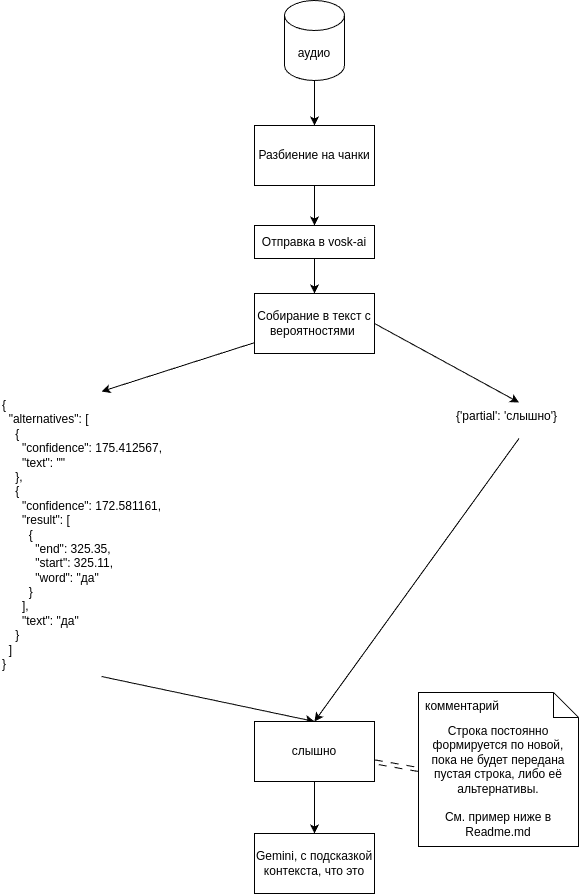

## Как это работает?

Подробнее об том, как примерно работает vosk-ai можно в [статье Яндекса](https://habr.com/ru/companies/yandex/articles/758782/)

### Требования:

Требует запущенного сервера Kaldi
https://alphacephei.com/vosk/install

Русская модель в Docker
https://hub.docker.com/r/alphacep/kaldi-ru

#### Библиотеки:
> asyncio, websockets, wave

#### Python:
> \>= 3.13.3 (рекомендуется)

#### Пример:
> Файл `transcription.txt` в корне репозитория, до обработки Gemini

> Файл `refactored.md` после обработки Gemini 2.5 Pro, Preview 05-06